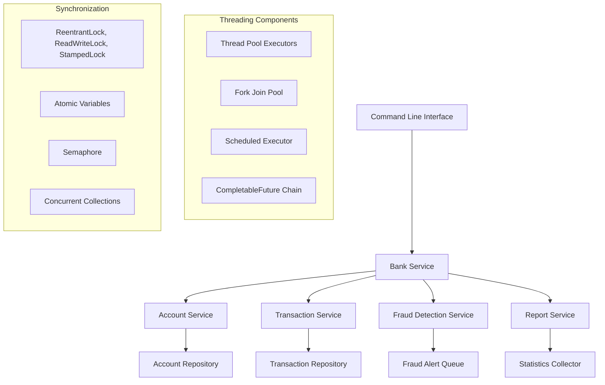

# Design Document

## Overview

The Bank Transaction Processing System is designed as a multi-threaded Java application that simulates real banking operations while demonstrating comprehensive concurrency concepts. The system consists of core banking entities (Account, Transaction) and specialized services that each showcase different threading mechanisms.

## Architecture



## Components and Interfaces

### 1. Core Domain Models

**Account Class**
- Uses ReentrantLock for thread-safe balance updates
- Implements ordered locking for transfer operations to prevent deadlocks
- Contains AtomicLong for transaction count tracking

**Transaction Class**
- Immutable transaction records
- Stored in ConcurrentHashMap for thread-safe access
- Uses AtomicReference for status updates

### 2. Account Service
- **Primary Threading Concept**: ReentrantLock and ordered locking
- **Methods**:
  - `deposit(accountId, amount)` - Uses ReentrantLock for balance updates
  - `withdraw(accountId, amount)` - Implements balance checking with locking
  - `transfer(fromId, toId, amount)` - Uses ordered locking to prevent deadlocks
- **Collections**: ConcurrentHashMap for account storage

### 3. Transaction Service
- **Primary Threading Concept**: CompletableFuture chains and ThreadPoolExecutor
- **Methods**:
  - `processTransactionAsync(transaction)` - Uses CompletableFuture.supplyAsync
  - `validateTransaction(transaction)` - Returns CompletableFuture<Boolean>
  - `executeTransaction(transaction)` - Chains with thenCompose
  - `logTransaction(result)` - Uses thenAccept for side effects
- **Executor**: Custom ThreadPoolExecutor for transaction processing

### 4. Fraud Detection Service
- **Primary Threading Concept**: Semaphore, BlockingQueue, and inter-thread communication
- **Components**:
  - Semaphore to limit concurrent fraud checks (simulating limited fraud detection resources)
  - BlockingQueue for fraud alert processing
  - Producer-Consumer pattern for alert handling
  - AtomicInteger for fraud detection counters

### 5. Report Service
- **Primary Threading Concept**: ReadWriteLock, StampedLock, and ScheduledThreadPoolExecutor
- **Methods**:
  - `generateAccountReport()` - Uses ReadWriteLock for concurrent reads
  - `calculateBankStatistics()` - Uses StampedLock for optimized reading
  - `schedulePeriodicReports()` - Uses ScheduledThreadPoolExecutor
- **Collections**: Thread-safe collections for report data

### 6. Statistics Collector
- **Primary Threading Concept**: Atomic variables and ForkJoinPool
- **Components**:
  - AtomicLong for transaction counts, total amounts
  - AtomicReference for complex statistics objects
  - ForkJoinPool for parallel statistics calculation across multiple accounts

## Data Models

### Account
```java
public class Account {
    private final String accountId;
    private volatile double balance;
    private final ReentrantLock balanceLock;
    private final AtomicLong transactionCount;
    private final AtomicReference<LocalDateTime> lastActivity;
}
```

### Transaction
```java
public class Transaction {
    private final String transactionId;
    private final String fromAccount;
    private final String toAccount;
    private final double amount;
    private final TransactionType type;
    private final AtomicReference<TransactionStatus> status;
    private final LocalDateTime timestamp;
}
```

### FraudAlert
```java
public class FraudAlert {
    private final String alertId;
    private final String accountId;
    private final String reason;
    private final double suspiciousAmount;
    private final LocalDateTime timestamp;
}
```

## Threading Implementation Details

### 1. CompletableFuture Chain Example
```java
// Transaction processing chain demonstrating all CompletableFuture methods
CompletableFuture<Transaction> processTransaction(Transaction transaction) {
    return CompletableFuture
        .supplyAsync(() -> validateTransaction(transaction), validationExecutor)
        .thenApply(isValid -> isValid ? transaction : null)
        .thenApplyAsync(this::enrichTransactionData, enrichmentExecutor)
        .thenCompose(this::checkFraudAsync)
        .thenCombine(getAccountBalanceAsync(transaction.getFromAccount()), 
                    (trans, balance) -> processWithBalance(trans, balance))
        .thenCombineAsync(updateAccountAsync(transaction), 
                         (result, updateStatus) -> finalizeTransaction(result, updateStatus))
        .thenAccept(this::logTransactionResult)
        .thenAcceptAsync(this::notifyCustomer, notificationExecutor);
}
```

### 2. Lock Ordering for Deadlock Prevention
```java
public void transfer(String fromId, String toId, double amount) {
    Account first = fromId.compareTo(toId) < 0 ? getAccount(fromId) : getAccount(toId);
    Account second = fromId.compareTo(toId) < 0 ? getAccount(toId) : getAccount(fromId);
    
    first.getLock().lock();
    try {
        second.getLock().lock();
        try {
            // Perform transfer
        } finally {
            second.getLock().unlock();
        }
    } finally {
        first.getLock().unlock();
    }
}
```

### 3. Producer-Consumer with BlockingQueue
```java
// Fraud detection using BlockingQueue for inter-thread communication
private final BlockingQueue<FraudAlert> fraudAlerts = new LinkedBlockingQueue<>();
private final Semaphore fraudCheckSemaphore = new Semaphore(3); // Limit concurrent checks

// Producer
public void reportSuspiciousActivity(FraudAlert alert) {
    fraudAlerts.offer(alert);
}

// Consumer
public void processFraudAlerts() {
    while (!Thread.currentThread().isInterrupted()) {
        try {
            FraudAlert alert = fraudAlerts.take();
            fraudCheckSemaphore.acquire();
            CompletableFuture.runAsync(() -> {
                try {
                    investigateAlert(alert);
                } finally {
                    fraudCheckSemaphore.release();
                }
            });
        } catch (InterruptedException e) {
            Thread.currentThread().interrupt();
            break;
        }
    }
}
```

## Error Handling

### Exception Management
- Custom exceptions for banking operations (InsufficientFundsException, AccountNotFoundException)
- CompletableFuture exception handling using handle() and exceptionally()
- Proper cleanup in finally blocks for all lock acquisitions
- Interrupt handling for long-running operations

### Resource Management
- Automatic executor shutdown using shutdown hooks
- Proper lock release in finally blocks
- Timeout mechanisms for long-running operations
- Memory leak prevention in concurrent collections

## Testing Strategy

### Unit Testing
- Mock executors for deterministic testing
- CountDownLatch for synchronization in tests
- Test lock contention scenarios
- Verify atomic operation correctness

### Integration Testing
- Stress testing with multiple concurrent operations
- Deadlock detection tests
- Performance benchmarking of different locking strategies
- CompletableFuture chain testing with various scenarios

### Concurrency Testing
- Use of CyclicBarrier for coordinated thread testing
- Race condition detection
- Thread safety verification
- Load testing with high transaction volumes

## Performance Considerations

### Optimization Strategies
- StampedLock for read-heavy operations (reports)
- Lock-free atomic operations where possible
- Appropriate thread pool sizing based on operation types
- Efficient concurrent collection usage

### Monitoring
- JMX beans for thread pool monitoring
- Atomic counters for performance metrics
- Thread dump analysis capabilities
- Real-time statistics display